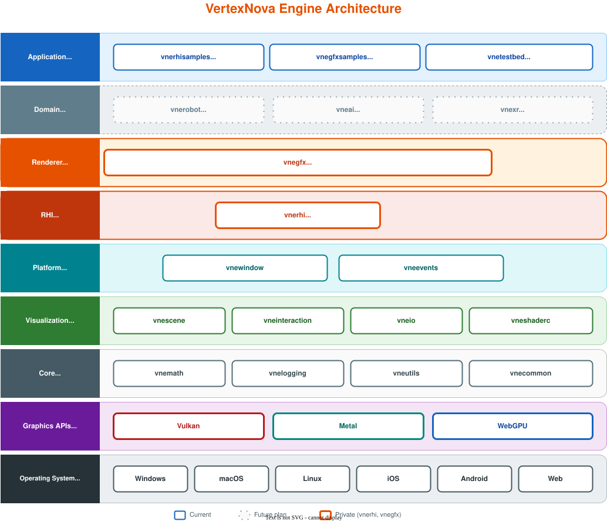
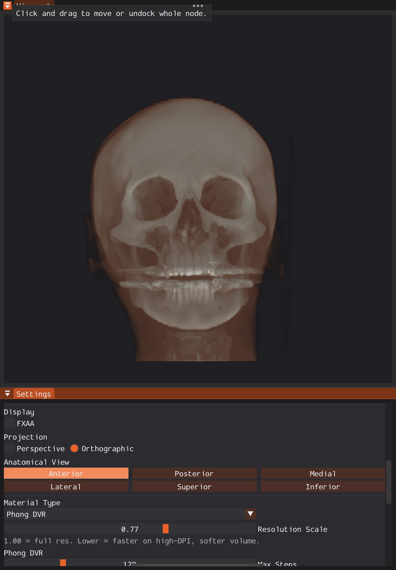
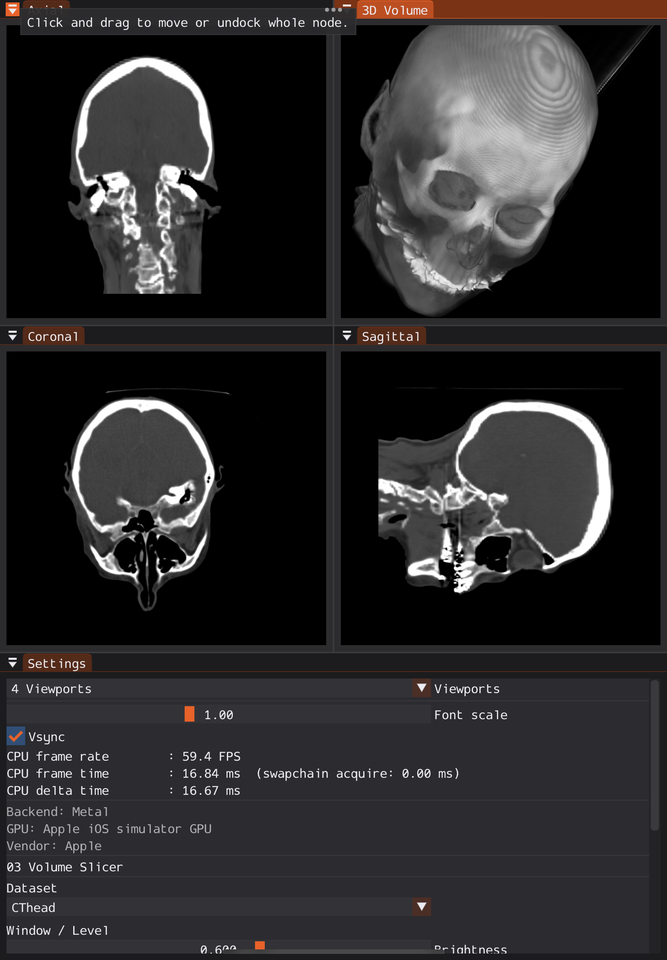
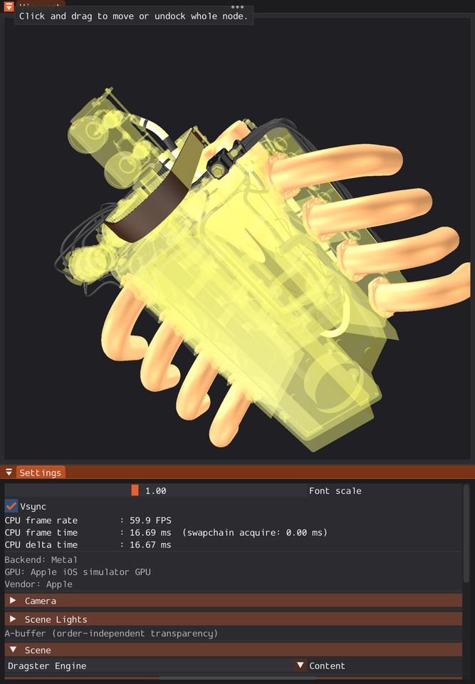
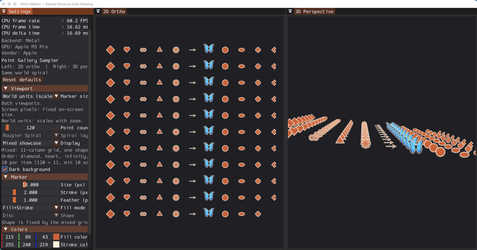
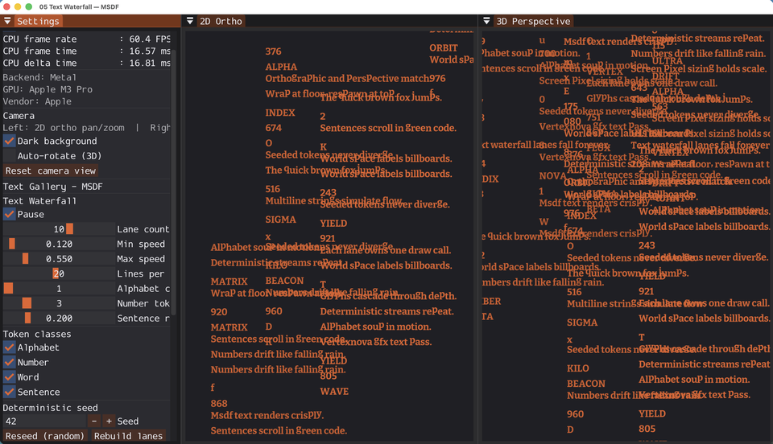

<p align="center">
  
</p>

<p align="center">
  <strong>A modular C++20 game and graphics engine, layered from the operating system and GPU drivers to the application.</strong>
</p>

<p align="center">
  
  
  
</p>

<p align="center">
  <a href="https://learnvertexnova.com">Website</a>
  ·
  <a href="https://vertexnova.github.io">vnerhi WebGPU samples</a>
</p>

Public libraries sit around a private RHI and renderer.

## Architecture

<p align="center">
  
</p>

<p align="center">
  <em> Orange is private (<code>vnerhi</code>, <code>vnegfx</code>). Dotted is future work (<code>vneanim</code>, <code>vneai</code>, <code>vnexr</code>).</em>
</p>

## Showcase

Silent 1080p reel of `vnegfx` samples on iOS (Metal) and desktop.  
[vnerhi WebGPU samples](https://vertexnova.github.io). Phase 0 results: [CrossGL demos](https://learnvertexnova.com/docs/docs/demos/crossgl-demos/). Site: [learnvertexnova.com](https://learnvertexnova.com).

<p align="center">
  <a href="showcase/vertexnova-showcase.mp4">Watch vertexnova-showcase.mp4</a> (44s)
</p>

<p align="center">
  
  
  
</p>
<p align="center">
  
  
</p>

## Explore the public stack

`vnerhi` (RHI) and `vnegfx` (renderer) are private. The modules around them are public and follow the same C++20 / CMake layout.

| Layer | Repository | Role |
|-------|------------|------|
| Visualization | [vnescene](https://github.com/vertexnova/vnescene) | Cameras, lights, and GPU-friendly scene state |
| Visualization | [vneinteraction](https://github.com/vertexnova/vneinteraction) | Camera manipulators and controllers |
| Visualization | [vneio](https://github.com/vertexnova/vneio) | Mesh, image, volume, font and video |
| Visualization | [vneshaderc](https://github.com/vertexnova/vneshaderc) | Offline GLSL to SPIR-V / MSL / WGSL / HLSL |
| Platform | [vnewindow](https://github.com/vertexnova/vnewindow) | Native windows (Win32, Cocoa, X11, Wayland, UIKit, Android, Web) |
| Platform | [vneevents](https://github.com/vertexnova/vneevents) | Keyboard, mouse, touch, and window events |
| Core | [vnemath](https://github.com/vertexnova/vnemath) | Vectors, matrices, geometry, graphics clip-space helpers |
| Core | [vnelogging](https://github.com/vertexnova/vnelogging) | Synchronous and asynchronous logging |
| Core | [vneutils](https://github.com/vertexnova/vneutils) | CLI parsing and shared helpers |
| Core | [vnecommon](https://github.com/vertexnova/vnecommon) | Platform detection, macros, non-copyable bases |

## Why it is structured this way

- **Single-purpose libraries** — scene, I/O, windowing, math, and logging can be learned and tested on their own.
- **GPU backends behind an RHI** — application code does not talk to Vulkan, Metal, or WebGPU directly.
- **Independent CI** — each repository configures, builds, and tests with the same CMake pattern.

## Build a public library

```bash
git clone --recursive https://github.com/vertexnova/<repo>.git
cd <repo>
cmake -S . -B build -DBUILD_TESTS=ON
cmake --build build -j
ctest --test-dir build
```

See each repository README for module-specific options, samples, and integration notes.

## Status

VertexNova is an educational and experimental project with a long-term goal. Testing meets a high standard. The stack is POC-ready, not production-ready.

## Contributing

Contributions are welcome once the public API and contribution workflow are finalized.  
For now, please open an issue to discuss proposals, bugs, or feature requests.

## License

See individual repositories for license information. Most use Apache License 2.0.
